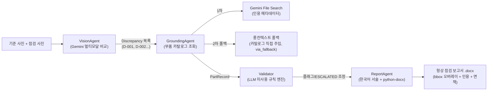

# AeroInspect — 항공기 축소 모형 형상 비교 점검 데모

항공기 축소 모형의 **기준(정상) 사진**과 **점검 사진**을 비교해 부품 누락·이상을 탐지하고,
가상 부품 카탈로그(mini-IPC)에서 근거를 찾아 결정론적 규칙으로 검증한 뒤,
**한국어 형상 점검 보고서(.docx)** 를 자동 생성하는 멀티에이전트 데모입니다.
LLM은 **Google Gemini 전용**(`google-genai` SDK)이며, LangChain 등 에이전트 프레임워크 없이
순수 Python으로 오케스트레이션합니다.

**데모 시나리오**: ① 정상 상태의 모형을 촬영해 기준 사진으로 사전 등록 → ② 라이브 데모에서
부품(예: 수직꼬리날개)을 분리한 뒤 같은 위치에서 점검 사진 촬영 → ③ Vision → Grounding →
Validator → Report 4단계 파이프라인이 차이를 탐지·검증 → ④ bbox 오버레이 사진과 카탈로그
인용이 포함된 `.docx` 점검 보고서를 즉석에서 다운로드.

## 아키텍처



- **VisionAgent**: 기준/점검 이미지를 한 번의 멀티모달 호출로 비교, 부품 체크리스트 기반 탐지
- **GroundingAgent**: 1차 File Search(인용 필수) → 스토어 미설정/실패 시 롱컨텍스트 폴백
- **Validator**: LLM을 쓰지 않는 결정론 규칙 — `REVIEW_REQUIRED` / `UNKNOWN_COMPONENT` /
  `SIDE_MISMATCH` / `UNGROUNDED` / `ESCALATED`(비행 필수 부품 누락 시 critical 상향 + 비행 금지 조치)
- **ReportAgent**: Gemini 한국어 서술 + `python-docx` 조립(기준·점검 사진 나란히 배치)

## 설치

### uv (권장)

```bash
uv sync --python 3.12
```

### pip (대안)

```bash
python3.12 -m venv .venv
source .venv/bin/activate
pip install "google-genai>=1.30.0" "pydantic>=2.8" "python-dotenv>=1.0" \
    "streamlit>=1.40" "python-docx>=1.1" "pillow>=10.4" \
    "pytest>=8.0" "pytest-asyncio>=0.24"
```

정확한 의존성 목록은 `pyproject.toml`을 참조하세요.

### .env 작성

```bash
cp .env.example .env
```

- `GEMINI_API_KEY` — **필수**. [Google AI Studio](https://aistudio.google.com/apikey)에서 발급.
- **Vertex AI 전환(선택)**: 아래 3개 환경변수를 설정하면 코드 수정 없이 Vertex 백엔드로 동작합니다.
  - `GOOGLE_GENAI_USE_VERTEXAI=true` — Vertex AI 백엔드 활성화
  - `GOOGLE_CLOUD_PROJECT` — GCP 프로젝트 ID
  - `GOOGLE_CLOUD_LOCATION` — 리전 (예: `us-central1`)
- 그 외 모델명·confidence 임계값·타임아웃 재정의 변수는 `.env.example` 주석을 참조하세요.

## File Search 셋업 (선택)

```bash
python scripts/setup_file_search.py                  # 스토어 생성 + 카탈로그 업로드 (멱등)
python scripts/setup_file_search.py --force-reupload # 카탈로그 수정 후 강제 재업로드
```

- 스크립트는 **멱등**입니다. 이미 스토어가 있으면 재사용하고, 스토어 이름을 `.env`의
  `AEROINSPECT_FILE_SEARCH_STORE`에 기록합니다.
- **실행하지 않아도 데모는 동작합니다** — 스토어가 없으면 GroundingAgent가 자동으로
  카탈로그 전문을 프롬프트에 주입하는 **롱컨텍스트 폴백**으로 전환합니다(보고서에 `via_fallback` 표시).

## 실행

```bash
streamlit run app.py
```

## 테스트

```bash
uv run pytest
```

Gemini 호출을 전부 mock한 E2E 스모크 테스트로, API 키 없이 실행 가능합니다.

## 촬영 가이드 (필수)

기준 사진과 점검 사진의 **시점 일치가 판독 정확도의 핵심**입니다.

1. **촬영 위치 고정** — 삼각대를 사용하거나, 바닥과 책상에 테이프로 카메라·모형 위치를 표시해
   기준 사진과 점검 사진을 반드시 같은 시점에서 촬영합니다.
2. **동일 조명** — 두 사진 사이에 조명을 바꾸지 마세요(그림자 변화는 오탐 원인).
3. **단순 배경** — 무지 천이나 빈 책상 위에서 촬영합니다(배경 물체는 이물질로 오인될 수 있음).
4. **분리 부품 선택** — 화면에서 뚜렷이 보이는 부품을 분리하세요.
   추천: **수직꼬리날개 · 수평꼬리날개 · 훈련용 미사일** 등 외곽 실루엣이 바뀌는 부품.
5. **여분 시나리오** — 부품 **2개 동시 분리** 케이스(예: 수직꼬리날개 + 미사일)도 미리 리허설해
   다중 탐지 데모를 준비합니다.

## 데모 리허설 체크리스트

- [ ] 행사장 네트워크(Wi-Fi/테더링) 연결 및 Gemini API 응답 확인
- [ ] 삼각대/테이프로 촬영 위치 고정 및 기준 사진 사전 등록
- [ ] **백업용 기준·점검 사진 세트**를 미리 촬영해 로컬에 확보(현장 촬영 실패 대비)
- [ ] File Search **폴백 경로 사전 테스트** — `.env`에서 `AEROINSPECT_FILE_SEARCH_STORE`를
      제거(주석 처리)한 상태로 1회 실행해 롱컨텍스트 폴백 동작 확인
- [ ] 분리한 부품 분실 방지용 **트레이** 준비
- [ ] API 키 유효성·쿼터(요금제 한도) 확인

## 면책

본 프로젝트는 **가상 데이터 기반 해커톤 데모**입니다. 부품 카탈로그·P/N·장착 절차·조치 기준은
모두 가상으로 작성된 것이며, 산출되는 보고서는 **실제 항공기 감항성 판단에 사용할 수 없습니다**.

# AeroInspect

## 설정 방법 (Setup)

1. 프로젝트 루트 디렉토리에 `.env` 파일을 생성하거나 수정합니다.
2. `GEMINI_API_KEY` 환경 변수에 Gemini API 키를 작성합니다.

```env
GEMINI_API_KEY=your_api_key_here
```

프로젝트 내에서 이 환경 변수를 불러와서 Gemini API를 사용하게 됩니다.
